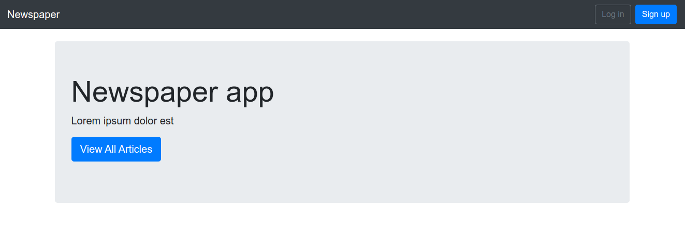
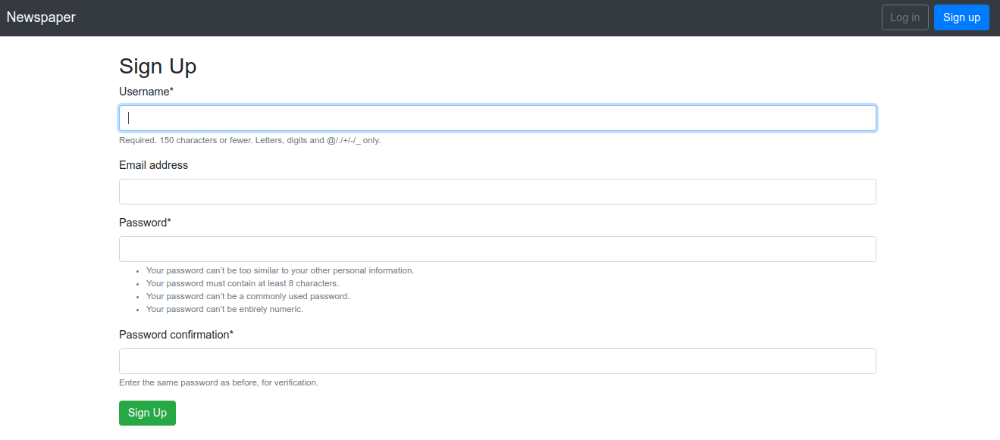
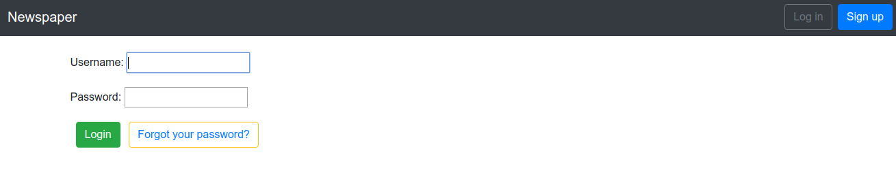
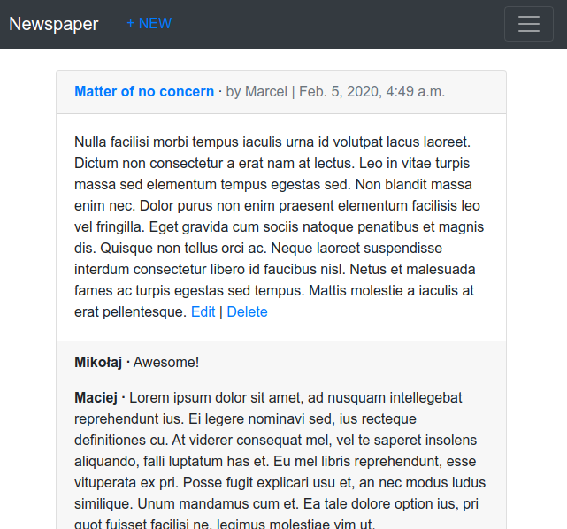

# Newspaper project

Newspaper project with CRUD functionality with user permissions & authorizations.
User's password resetting via user's email.

Signed Users can create & comment articles. 

Technologies used:
`Python 3.6.9`
`Django 3.0.3`
`Pipenv`
`Git`
`Bootstrap 4.0.0`
`HTML`
`CSS`
`Postgresql`

## Installation/ Setup

* Install pipenv using pip: `pip install pipenv`
* Run pipenv environment: `pipenv shell`
* Install all required dependencies: `pipenv sync` or `pipenv install`
* Create database: 
  1. `sudo -u postgres psql`
  2.  `CREATE DATABASE <db_name>;`
* Set database in settings.py
* Migrate

## App Workflow

After signing up user is redirected to log in. Only after loggingin user is allowed to write/edit/comment on selected articles.

Home Page

Signup Page

Login Page

List of articles with comments

## Author

Marcel Łagoda
